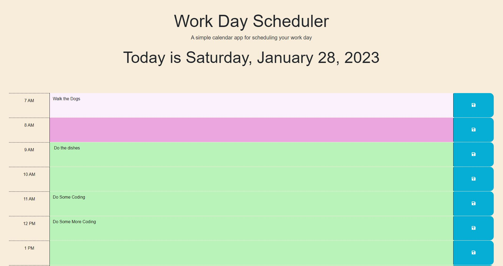
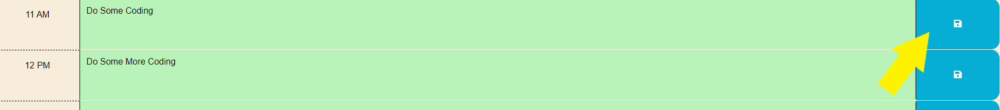

# Busy Bee Organizer

## Description

As a busy bee myself, I know there are times when I'm committing my presence to several events back-to-back. There are days when there's a lunch date, two meetings, child pickup, and a personal training session booked, and it's hard to keep track of what I have to do during which hours of the day. It can be a lot to keep up with. 

However, with this time organizer, anyone with a crazy schedule can easily see what has already passed, what you have to do now, and what events are coming up. The schedule is color-coded so the hour you're currently in is pink, future hours are green, and past events are faded pink.

## Installation

N/A

## Usage

When you navigate to the homepage, you will find today's date at the top with sections associated with time 7 AM - 7 PM. Past events are faded pink, current events are in pink, and future events are in green.

If there is an event you would like to add to your scheduler, type it in the box, and click the save button. 

If you would like to clear something from your scheduler, delete the event, and make sure to click the save button as well, just as you would saving a new event.

## Credits

<li><a href="https://www.youtube.com/watch?v=NJIOu7O-I-8">Tutorial on jQuery .each(), index, and value parameters</a></li>
